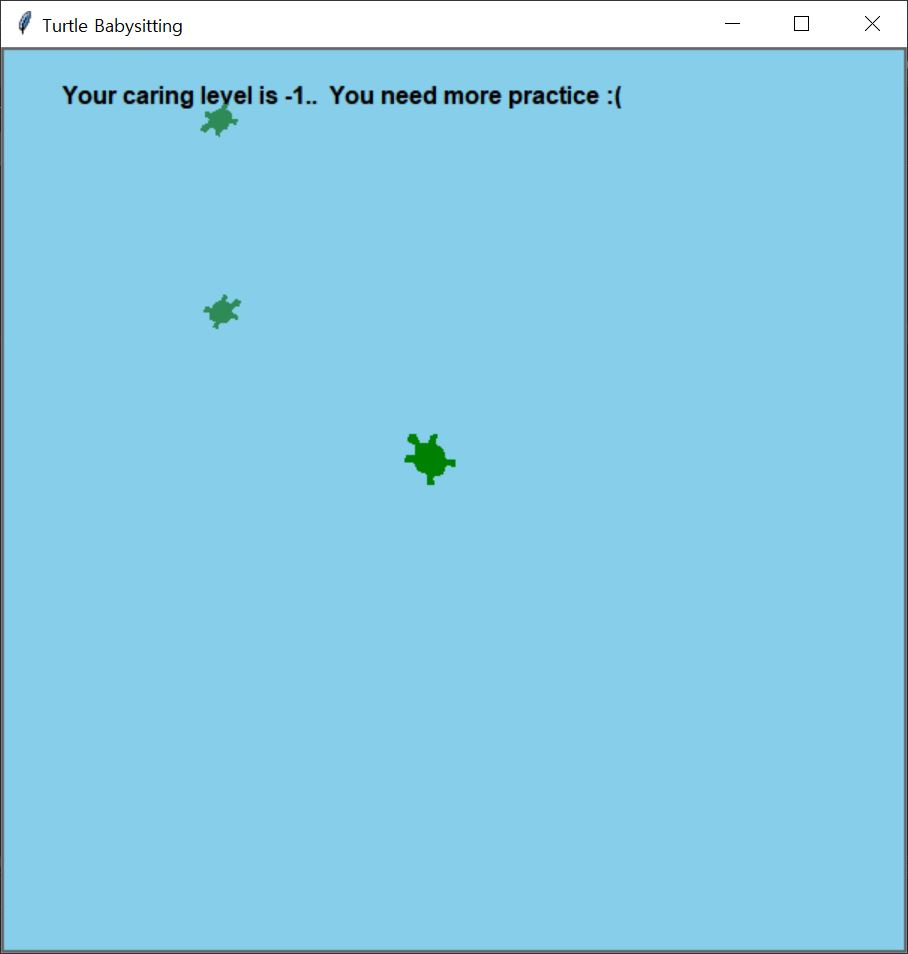

# Baby Turtle Care Game 🐢

## Overview

**Baby Turtle Care** is an interactive game where players control a "caring turtle" tasked with keeping two baby turtles safe. The objective is to protect the baby turtles from going outside the safe area, as the outside is dangerous.

## Features

- 🐢 **Turtle Characters**:

  - Two baby turtles that move randomly.
  - A caring turtle that the player controls.

- 🎮 **Gameplay Mechanics**:

  - The caring turtle must catch the baby turtles before they go out of bounds.
  - If the caring turtle goes outside before the end of working hours, it goes back to its initial position.
  - When the working hours end, you'll get the player's level of care and the appropriate message.

- 📊 **Score Tracking**:

  - If the player catches the baby turtle before it goes out of bounds, it will return to its initial position, and the player's level of care goes up.
  - If a baby turtle goes outside, it will return to its initial position, and the player's level of care goes down.

- ⏱️ **Timer**:

  - The task of taking care of the baby turtle is 60 seconds.

## Controls

- The caring turtle can be controlled using the keyboard:
  - **Up Arrow**: Move Forward ⬆️
  - **Down Arrow**: Move Backward ⬇️
  - **Left Arrow**: Turn Left ⬅️
  - **Right Arrow**: Turn Right ➡️

## Game Objective

- Ensure the baby turtles remain within the safe area and do not venture outside.
- Monitor the remaining time and aim to maximize your caring level by catching the baby turtles.

## Development

This game is built using Python's `turtle` and `tkinter` libraries.

## Game Execution Screen

1. Start Screen

   

2. When the baby turtle goes out

   

3. When the caring turtle goes out

   

4. When you get the high level on result

   

5. When you get the low level on result

   
